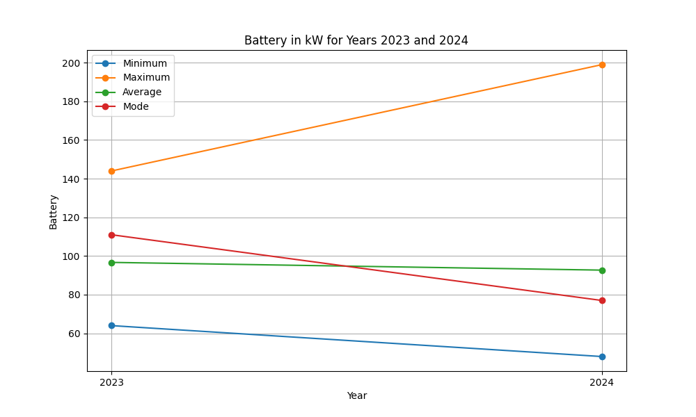
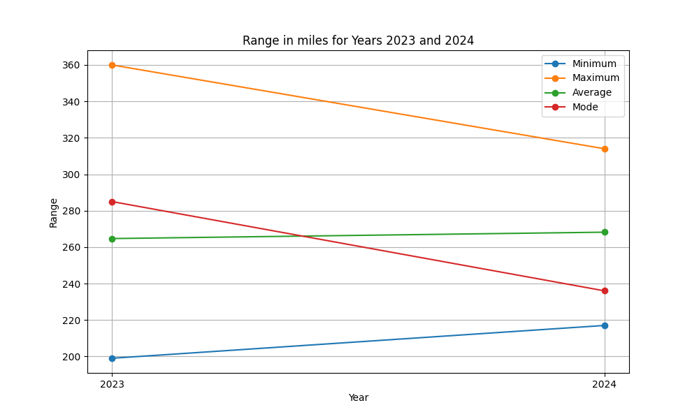

---
title: statistical analysis - EVs
layout: default
---

### Introduction

In my previous course (project management) I was working on an idea to convert ICE trucks to EV trucks. I noticed that the conversion idea itself took off but often with a polite hint of skepsis. The Skepsis as I found out later, was based on the fear of being stranded on the highway with a dead battery due to insufficient network of recharging stations. According to a Pew Research Center study, 53% of Americans have low levels of confidence that the US will build necessary EV infrastructure (survey conducted 05/30-06/04, 2023). 

So the question that I was trying to clarify for myself was: why would someone fear the lack of recharging opportunities when the range is comparable to an ICE?
Hence, the idea is to look if the capability to range actually suffices. To make it even more self evident I add the worse case scenario by looking at EVs that are bigger, heavier and therefore more vulnerable to being stranded on side of the road with an empty battery - SUV-EVs.

### Source of my selected dataset
The US department of Energy has a website which allows all sorts of selections in regard to EVs. My selection [link] included non commercial non fleet all electric SUV-EVs 
with the models from 2022 till 2024.
[link].

Key features of the dataset

The number of observations (rows) and variables (columns), as well as any unique identifiers or categorical variables.

I downloaded their excel file and converted to a csv file which entailed the years from 2024 till 2022.
Since the 2022 observations didn’t list data on the batteries variable, I had to leave them out of this analysis.

The remaining 7 variables and 70 observations (rows), a third of the data had not one specific number of miles as range but a range of miles in the ‘Range’ column. In each case I replaced the range of miles with its average.

### Level of measurement

For the purpose of this analysis I reduced the number of columns/variables to 7 

3 Nominal Variables
- Manufacturer
- Model
- Drivetrain
4 Interval Variables
- Year
- Range
- Battery
- Engine Size (e-motor)

### Libraries which I used in this analysis

- Python (For Coding)
- Pandas (Data Wrangling)
- NumPy (Numerical Analysis)
- Matplotlib (Data Visualization)
- Seaborn (Data Visualization)

### Analysis

- For 2024 there are 15 Manufacturers and for the year 2023 16.

- Minimum, Maximum, Average, and Mode of Range Variable grouped by Year

The average range would leave me stranded on the highway, 35 miles missing till home. But the maximum range would work. Now let’s look how big the battery would need to be.

These numbers are showing:
Batteries
- the biggest available batteries in 2023 got bigger in 2024, 
- the smallest available batteries got even smaller from 2023 to 2024. 

Range
- the maximum range came down from 2023 to 2024
- the minimal range went up from 2023 to 2024.

